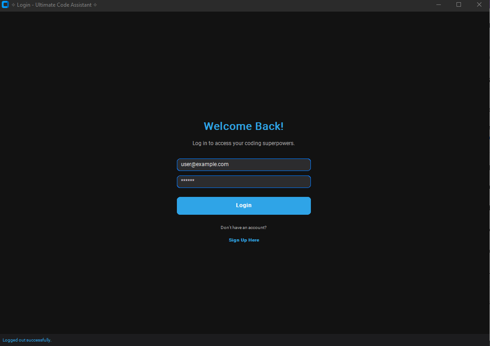
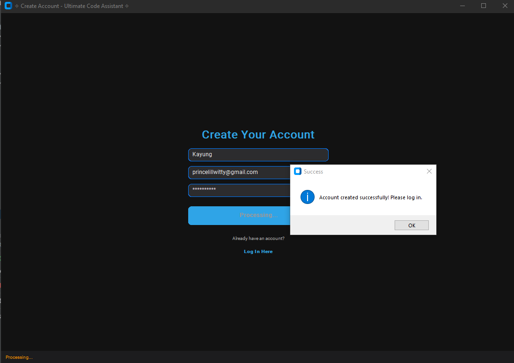
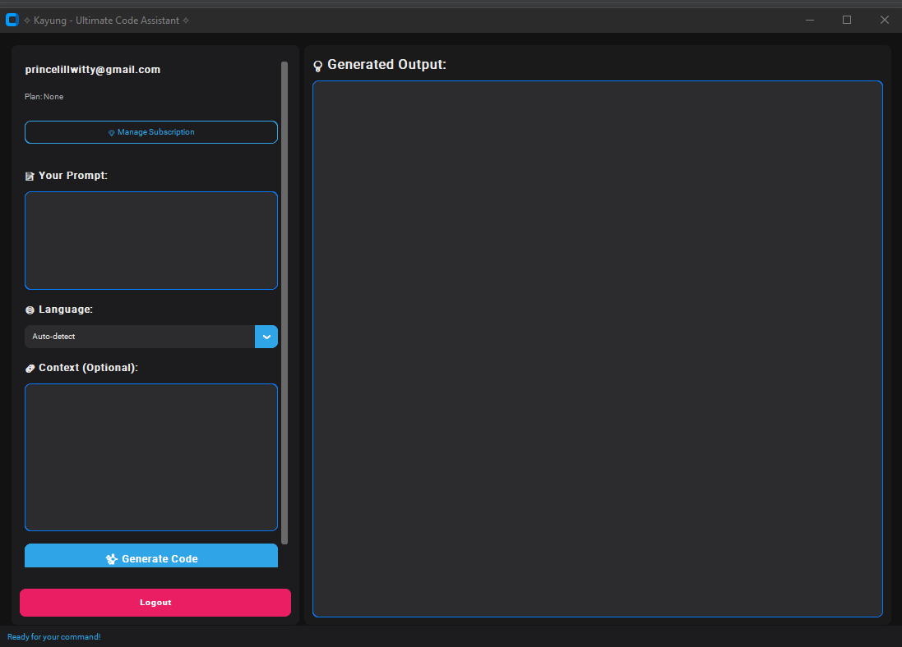
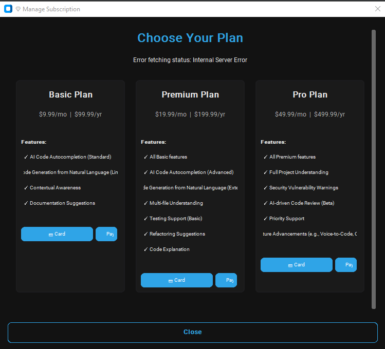
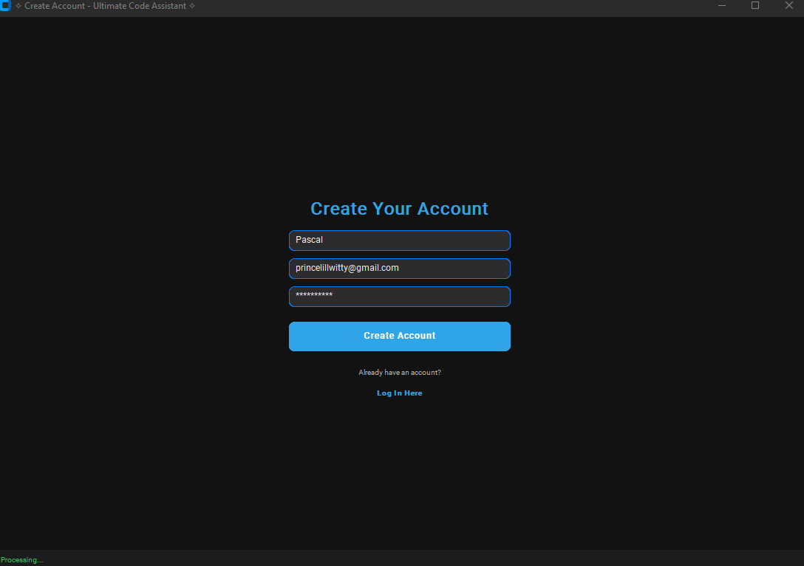
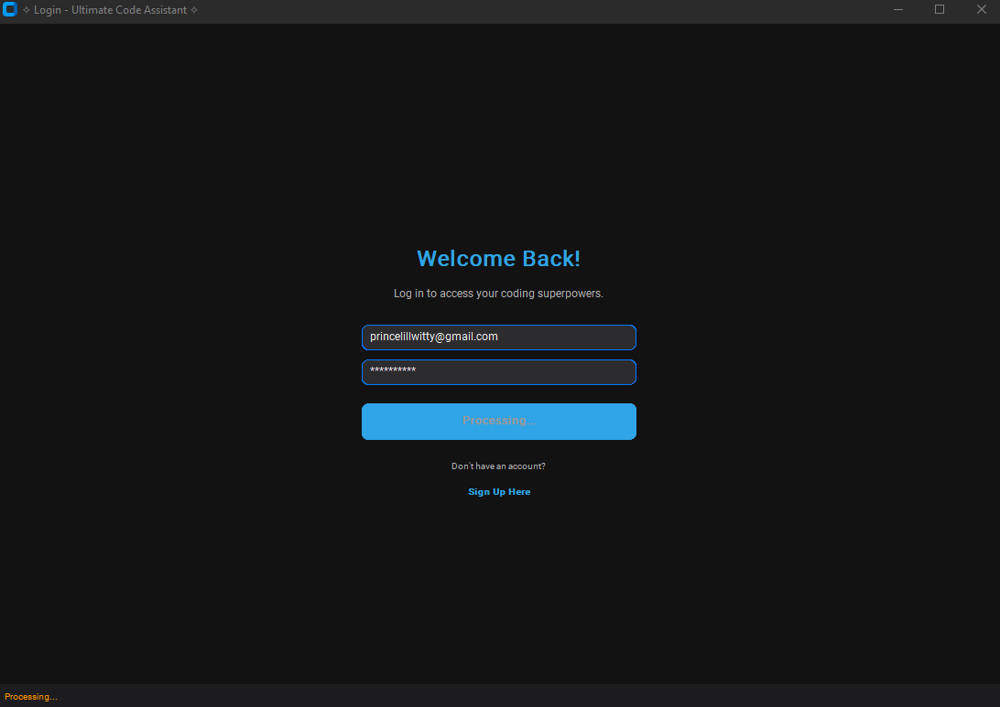

# ✧ Corda - Ultimate Code Assistant ✧

The Corda - Ultimate Code Assistant is a powerful, AI-driven application designed to supercharge your coding workflow. It combines an intelligent FastAPI backend with a sleek CustomTkinter frontend to provide a seamless and feature-rich coding assistance experience, complete with subscription management and (simulated) payment integration.

## ✨ Features

*   **AI-Powered Code Assistance:**
    *   **Code Generation:** Generate code snippets and functions from natural language prompts.
    *   **Code Explanation:** Understand complex code blocks with AI-generated explanations (conceptual).
    *   **Code Refactoring:** Get suggestions for improving your code structure and efficiency (conceptual).
    *   **Contextual Awareness:** (Placeholder) The system is designed to understand code context.
    *   **Multi-language Support:** (Placeholder) Configurable for various programming languages.
*   **Subscription Management:**
    *   Multiple subscription tiers (Basic, Premium, Pro) with distinct feature sets.
    *   User registration and login.
    *   (Simulated) Payment integration for:
        *   Stripe (Visa/Mastercard)
        *   PayPal
        *   Cryptocurrency
*   **Modern User Interface:**
    *   Visually appealing and responsive desktop application built with CustomTkinter.
    *   Themed interface for a consistent look and feel.
*   **Robust Backend:**
    *   Built with FastAPI, ensuring high performance and scalability.
    *   Secure authentication using JWT.
    *   Modular design for easy extension.

## 📸 Screenshots

|                        Login Screen                         |                     Create Account Form                     |
|:-----------------------------------------------------------:|:-----------------------------------------------------------:|
|                       |       |
|             **Main Code Generation Interface**              |               **Subscription Plan Selection**               |
|  |  |
|         *Registration Success & Processing States*          |                  *Login Processing State*                   |
|               |                  |


## 🛠️ Tech Stack

*   **Frontend:**
    *   Python 3.10+
    *   CustomTkinter: For the modern graphical user interface.
    *   Requests: For communicating with the backend API.
*   **Backend:**
    *   Python 3.10+
    *   FastAPI: High-performance web framework.
    *   Uvicorn: ASGI server.
    *   Pydantic: Data validation and settings management.
    *   Python-JOSE & Passlib: For JWT authentication and password hashing.
    *   Bcrypt: Password hashing algorithm.
    *   Aiosqlite: Asynchronous SQLite driver (for in-memory/file-based demo database).
    *   Dotenv: For environment variable management.
*   **Database (Demonstration):**
    *   Currently uses an in-memory dictionary for users and subscriptions, reset on each backend restart.
    *   For persistent storage, integration with a relational database (e.g., PostgreSQL, MySQL) using SQLAlchemy and Alembic for migrations would be the next step.
*   **AI Model (Placeholder):**
    *   The current code assistant service (`code_assistant_service.py`) uses placeholder logic. For real AI capabilities, this service would integrate with large language models (LLMs) via APIs (e.g., OpenAI, Hugging Face, or self-hosted models).

## 📂 Project Structure

```
Corda/
├── backend/
│   ├── app/
│   │   ├── api/            # API endpoint definitions
│   │   ├── core/           # Configuration, security
│   │   ├── models/         # Pydantic models for data structures
│   │   ├── services/       # Business logic (AI, payments)
│   │   ├── main.py         # FastAPI application entry point
│   │   └── __init__.py
│   ├── requirements.txt    # Backend dependencies
│   └── .env.example        # Example environment file
├── frontend/
│   ├── app_frontend.py     # CustomTkinter application
│   ├── ui_theme.json       # Theme configuration for the UI
│   ├── requirements.txt    # Frontend dependencies
│   └── assets/             # (Optional) For images, icons
└── README.md
```

## 🚀 Setup and Installation

### Prerequisites

*   Python 3.10 or higher
*   `pip` (Python package installer)
*   Git (for cloning the repository)

### 1. Clone the Repository

```bash
git clone <repository_url>
cd Corda
```

### 2. Backend Setup

```bash
cd backend

# Create and activate a virtual environment (recommended)
python -m venv venv_backend
# On Windows:
source venv_backend/Scripts/activate
# On macOS/Linux:
# source venv_backend/bin/activate

# Install backend dependencies
pip install -r requirements.txt

# Create a .env file from the example (if .env.example exists, or create one manually)
# Example .env content:
# SECRET_KEY=your_very_strong_random_secret_key_for_jwt
# ALGORITHM=HS256
# ACCESS_TOKEN_EXPIRE_MINUTES=10080 # 7 days

# Optional: For real payment gateways, you'd add their API keys here:
# STRIPE_PUBLISHABLE_KEY=pk_test_your_stripe_publishable_key
# STRIPE_SECRET_KEY=sk_test_your_stripe_secret_key
# PAYPAL_CLIENT_ID=your_paypal_client_id
# PAYPAL_CLIENT_SECRET=your_paypal_client_secret
# CRYPTO_API_KEY=your_crypto_gw_api_key

# Run the backend server (from the 'Corda' root directory)
cd .. # Go back to Corda directory if you were in backend/
uvicorn backend.app.main:app --reload
```
The backend will typically be available at `http://127.0.0.1:8000`.

### 3. Frontend Setup

```bash
cd frontend

# Create and activate a virtual environment (recommended)
python -m venv venv_frontend
# On Windows:
source venv_frontend/Scripts/activate
# On macOS/Linux:
# source venv_frontend/bin/activate

# Install frontend dependencies
pip install -r requirements.txt

# Run the frontend application (from the 'Corda/frontend/' directory)
python app_frontend.py
```

## ⚙️ Configuration

*   **Backend:**
    *   Environment variables are managed in the `.env` file located in the `backend/` directory.
    *   `SECRET_KEY`: A crucial secret for signing JWTs. Generate a strong random string.
    *   Other keys like `STRIPE_SECRET_KEY` would be needed for actual payment processing.
*   **Frontend:**
    *   `BACKEND_URL`: Defined at the top of `frontend/app_frontend.py`. Ensure this matches your running backend address (default: `http://localhost:8000/api/v1`).
    *   `ui_theme.json`: Located in `frontend/`. This file controls the visual appearance (colors, fonts, padding) of the CustomTkinter application.

## 🎮 Usage

1.  **Start the Backend:** Ensure the FastAPI backend server is running.
2.  **Start the Frontend:** Run `python app_frontend.py` from the `frontend/` directory.
3.  **Register/Login:**
    *   The application will open to a login screen.
    *   You can register a new account or use the pre-filled default user:
        *   Email: `user@example.com`
        *   Password: `string`
    *   Another test user: `basic@example.com` / `basicpass`
4.  **Code Generation:**
    *   Once logged in, you'll see the main interface.
    *   Enter your natural language prompt in the "Your Prompt" text area.
    *   Optionally, select a target language and provide additional context code.
    *   Click "✨ Generate Code". The AI-generated (placeholder) code will appear in the output area.
5.  **Manage Subscription (Simulated):**
    *   Click "💎 Manage Subscription".
    *   A new window will show available plans.
    *   You can "subscribe" using simulated payment buttons for Card, PayPal, or Crypto. This will update your user's plan in the (in-memory) backend.

## 🌐 API Endpoints (Overview)

The FastAPI backend exposes the following main groups of endpoints under `/api/v1/`:

*   `/auth/`: User registration (`/register`), login (`/login`), get current user (`/me`).
*   `/users/`: User management (e.g., update user details).
*   `/assist/`: Code assistance features (`/generate-code`, `/explain-code`, `/refactor-code`).
*   `/subscriptions/`: List available plans (`/plans`), get user's subscription status (`/status`).
*   `/payments/`: Process subscription payments (`/subscribe/{payment_gateway}`).

You can explore the full API documentation by navigating to `http://127.0.0.1:8000/api/v1/docs` in your browser when the backend is running.

## 🚀 Future Enhancements

This project serves as a strong foundation. Future advancements could include:

*   **Real AI Model Integration:** Connecting to actual LLMs (OpenAI, Claude, local models).
*   **Advanced AI Features:** Implementing all features from the "Future Advancements" list in the initial prompt, such as:
    *   Full Project Understanding & Autonomous Code Agents.
    *   Voice-to-Code & Conversational Coding.
    *   AI-driven Code Review & Automated Bug Fixing.
*   **Persistent Database:** Integrating a robust database like PostgreSQL with SQLAlchemy.
*   **Real Payment Gateway Integration:** Implementing full Stripe, PayPal, and Crypto payment flows.
*   **WebSockets:** For real-time features like live autocompletion.
*   **Enhanced UI/UX:** Adding more interactive elements, visualizations, and settings.
*   **Testing:** Comprehensive unit, integration, and end-to-end tests.
*   **Deployment:** Dockerization and deployment to cloud platforms.
*   **Cross-Language Intelligence & Compliance Enforcement.**

## 🤝 Contributing

Contributions are welcome! If you'd like to contribute, please:

1.  Fork the repository.
2.  Create a new branch (`git checkout -b feature/YourFeature`).
3.  Make your changes.
4.  Commit your changes (`git commit -m 'Add some feature'`).
5.  Push to the branch (`git push origin feature/YourFeature`).
6.  Open a Pull Request.

Please ensure your code adheres to good practices and includes relevant documentation or tests.

## 📄 License

This project is licensed under the MIT License - see the `LICENSE` file for details (if you choose to add one).

---

Happy Coding! ✨
